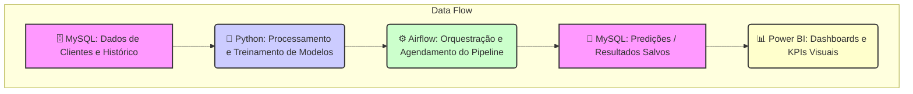

# 🚀 **Análise e Previsão de Churn no Setor de Telecomunicações**

  
  
  
  
  

---

## 🧠 **Sobre o Projeto**

Este projeto tem como objetivo **prever o risco de cancelamento (churn)** de clientes em uma empresa de telecomunicações, utilizando **Machine Learning**, **automação com Airflow** e **visualização interativa no Power BI**.

A iniciativa simula um pipeline completo de dados — desde o armazenamento no **MySQL**, passando pelo processamento e modelagem em **Python**, orquestração automatizada via **Apache Airflow**, até a análise final no **Power BI**.

O propósito é demonstrar como **dados históricos e aprendizado de máquina** podem ser usados para **antecipar o comportamento dos clientes**, otimizando estratégias de retenção e melhorando a tomada de decisão.

---

## ⚙️ **Principais Tecnologias Utilizadas**

| Etapa | Ferramenta | Descrição |
|-------|-------------|-----------|
| 🗄️ **Banco de Dados** | **MySQL** | Armazenamento e histórico dos clientes, base central para consumo de dados. |
| 🐍 **Modelagem** | **Python (Pandas, Scikit-learn, XGBoost)** | Limpeza, engenharia de atributos, treino e avaliação dos modelos de churn. |
| ⚙️ **Orquestração** | **Apache Airflow** | Automação e agendamento dos processos de modelagem e previsão. |
| 📊 **Visualização** | **Power BI** | Criação de dashboard interativo com KPIs e insights sobre churn. |
| 🐳 **Infraestrutura** | **Docker** | Contêinerização do ambiente para fácil replicação e execução. |

---

## 🧩 **Arquitetura do Projeto**

### 🔄 **Fluxo do Processo**
1️⃣ **Coleta e Armazenamento** → Os dados são armazenados no **MySQL**, que serve como base central do projeto.  
2️⃣ **Modelagem e Predição** → Um script em **Python** faz a limpeza, engenharia de atributos e treinamento do modelo de *churn prediction*.  
3️⃣ **Automação com Airflow** → O **Apache Airflow** automatiza todo o fluxo de atualização e geração das novas predições.  
4️⃣ **Resultados e Visualização** → As predições são gravadas novamente no **MySQL**, e o **Power BI** consome esses dados em tempo real para exibir **KPIs e insights**.

> 💡 O fluxo pode ser resumido assim:  
> **MySQL → Python (Modelagem e Treinamento) → Airflow (Automação)**  
> &nbsp;&nbsp;&nbsp;&nbsp;&nbsp;↓  
> **Predições → Power BI (Visualização e KPIs)**  

---

## 📈 **Principais KPIs**

Os indicadores definidos no Power BI permitem avaliar a **saúde do negócio** e **detectar padrões de comportamento** de cancelamento:

| KPI | Descrição |
|------|------------|
| **Taxa de Churn (%)** | Percentual de clientes que cancelaram seus serviços. |
| **Risco Médio Por Serviço** | Percentual médio de cancelamento dos clientes por serviço. |
| **Clientes por Segmento de Risco** | Quantidade de clientes classificados como “Alto”, “Médio” e “Baixo” risco. |
| **Churn por Tipo de Contrato** | Distribuição de cancelamentos conforme o tipo de plano. |
| **Churn por Método de Pagamento** | Distribuição de cancelamentos conforme o método de pagamento. |

---

## 📊 **Dashboard Power BI**

O dashboard foi dividido em **4 páginas principais**:

1️⃣ **Dados Gerais** — KPIs globais e taxa total de churn.  
2️⃣ **Mapeamento de Perfil** — Características demográficas e contratuais.  
3️⃣ **Dados por Serviço** — Principais causas e padrões de churn por serviço.  
4️⃣ **Contratos e Pagamentos** — Análise de churn por contrato e método de pagamento.

> 🎨 O design segue um estilo **corporativo e minimalista**, com **layout intuitivo e visual limpo**, ideal para apresentações executivas.

---

## 🤖 **Modelos Utilizados**

Foram testados diferentes algoritmos de classificação binária:

- **Logistic Regression**
- **Random Forest**
- **XGBoost**

O modelo final foi escolhido com base em **recall e AUC-ROC**, priorizando a **detecção correta dos clientes de alto risco de churn**.

---

## 🧠 **Principais Aprendizados**

- Aplicação prática de **Machine Learning** com dados de telecom.  
- Construção de **pipelines automatizados** via Airflow.  
- Criação de **dashboards corporativos** em Power BI.  
- Integração entre **banco de dados, modelagem e visualização**.  
- Uso do **Docker** para padronizar ambientes de execução.

---

## 🧱 **Estrutura do Projeto**

📦 projeto_churn/  
├── dags/ → DAGs do Airflow  
├── scripts/ → Scripts Python de modelagem e predição  
├── models/ → Modelos e escalers salvos  
├── logs/ → Logs do Airflow  
├── Dockerfile → Imagem personalizada do Airflow  
├── docker-compose.yml → Orquestração dos contêineres  
├── clientes_churn_utf8.csv → Base de dados original  
├── churn_predictions_history.csv → Resultados do modelo  
└── README.md → Documentação do projeto

---

## 🧭 **Como Executar**

1️⃣ Clonar o repositório  
git clone https://github.com/GiovanniSousa7/projeto_churn.git 
cd projeto_churn

2️⃣ Iniciar o ambiente Docker 
docker compose up --build

3️⃣ Acessar o Airflow 
http://localhost:8080 
Usuário: admin 
Senha: admin

4️⃣ Visualizar o Dashboard 
Importe o arquivo .PBIX no Power BI Desktop.

👨🏻‍💻 Autor

Giovanni Sousa
📊 Data Science and Analytics | IA |  ETL | Python | SQL  | Power BI | Machine Learning

    

